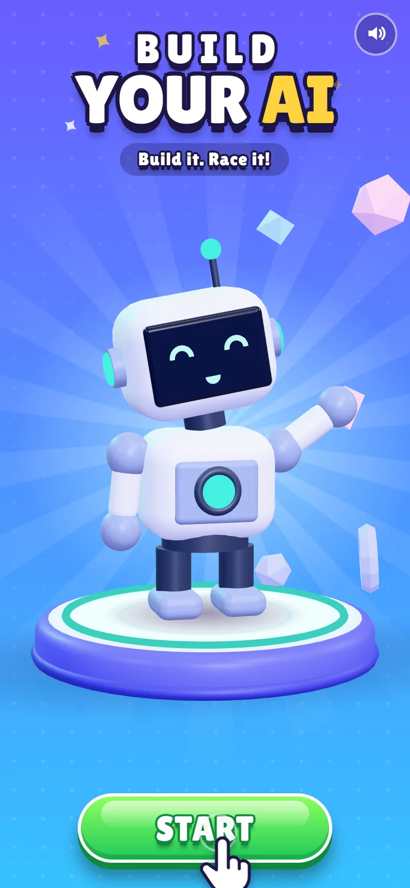
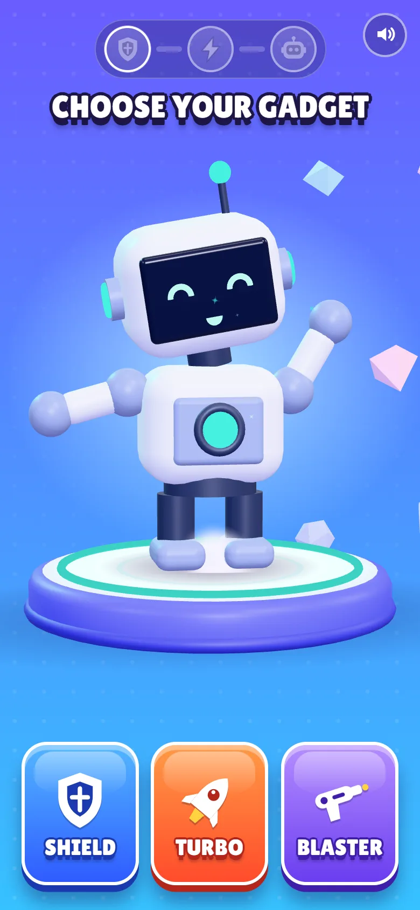
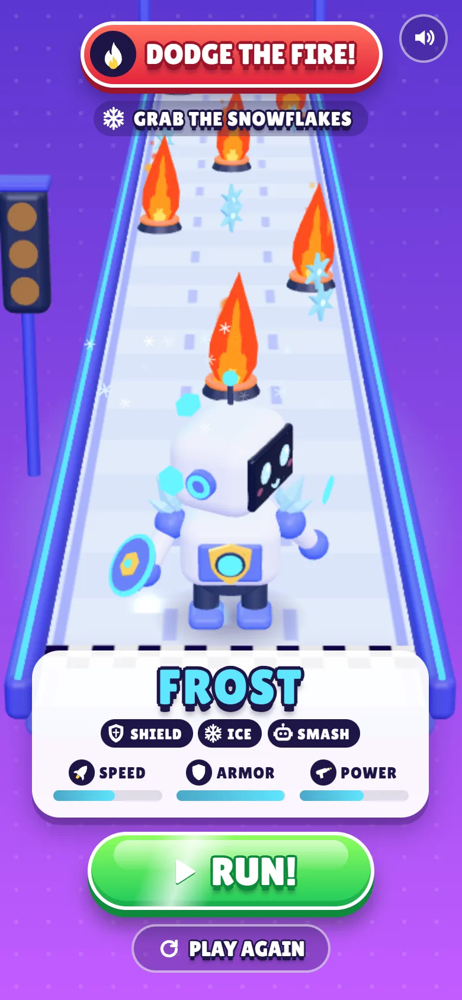
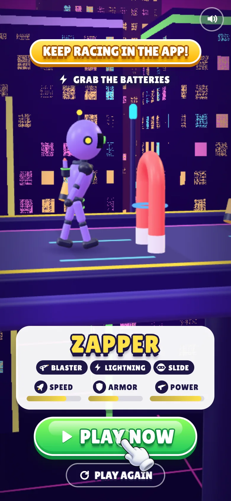
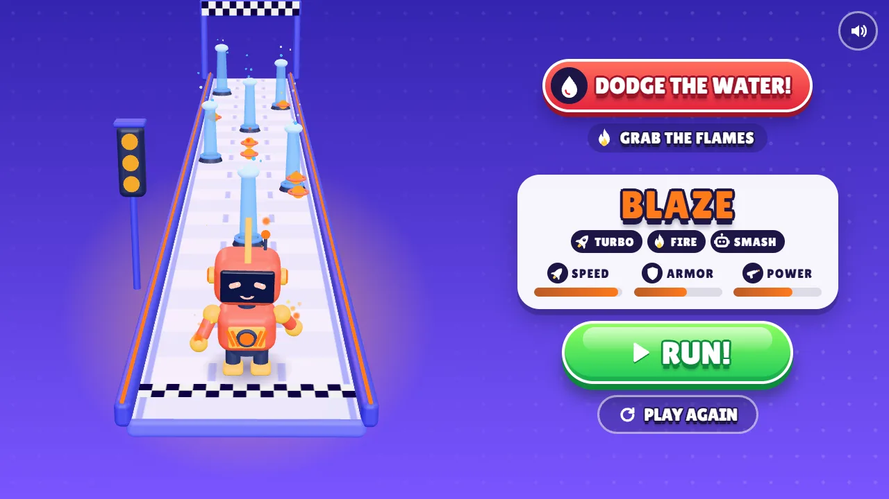
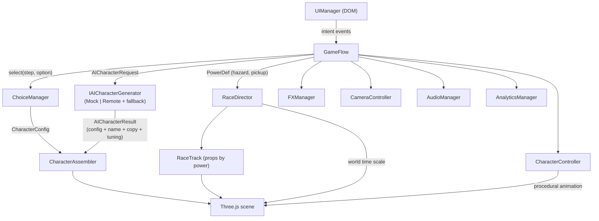

# Build Your AI

A mobile-first **HTML5 playable ad** for a runner game. In about 20–40 seconds the player builds an AI racer in three quick choices and watches it assemble in 3D. The racer is then lined up on a 3-lane track whose obstacles depend on those choices. The **RUN!** call to action sends the player to the store to race it.

The engine is **TypeScript + Three.js** on a hand-written game layer. There is no game engine, no UI framework and no asset download: every character, track, sound and effect is generated at runtime. The production build is one self-contained HTML file.

<p align="center">
  
  
  
  
</p>
<p align="center">
  
</p>

## Live Demo

**▶ Play:** _add your deployment URL here_ (the included GitHub Pages workflow publishes `dist/index.html` on every push to `main`).

| URL parameter | Effect |
| --- | --- |
| `?dev=0` | Hides the developer overlay (the clean ad experience) |
| `?cta=CREATE%20YOUR%20AI` | Overrides the start-line CTA label (A/B test hook) |
| `?sound=0` | Starts muted |
| `?dpr=1` | Caps the render pixel ratio |
| `?ai=remote` | Routes generation to a server endpoint; it falls back to the mock when that fails |
| `?nowebgl` | Previews the graceful-degradation screen |

Press **D** (or tap the `DEV` pill) to open live render stats and the analytics event stream.

## Gameplay

```
INTRO ─▶ GADGET ─▶ POWER ─▶ BODY ─▶ BUILD ─▶ READY! ─▶ START LINE (RUN!) ─▶ teaser run ─▶ cliffhanger (PLAY NOW)
```

1. **Intro.** A robot on a pedestal waves at the player under the line "Build it. Race it!". **START** is the only action, and a tutorial hand appears after 1.2 s of idling.
2. **Three choices.** Each choice changes the character immediately and matters in the race (see the table below).
3. **Build.** The parts explode outward, a scanner sweeps the body, the parts snap back one by one, the eyes power on and the racer jumps into a hero pose. The AI request runs during this animation, so its latency is hidden.
4. **Ready!** A short beat with the generated name (`FROST`, `VOLT`, `COMET`…) and a tagline.
5. **Start line (the end card).** The pedestal drops away and a 3-lane track unrolls behind the racer. The racer waits on the start line, glancing back at the obstacles its power is weak to: **"DODGE THE FIRE!"**. A racer card shows the build as chips and stats, with a big **RUN!** CTA.
6. **RUN!** opens the store. Behind it, the start lights count 3-2-1-GO, and the racer turns, sprints, switches lanes around a hazard and grabs pickups. Then the scene drops into **bullet time** in front of the next hazard, in a side-on shot, with "KEEP RACING IN THE APP!" and a **PLAY NOW** CTA.

**PLAY AGAIN** resets all state in code: no page reload and no leaked objects.

### Choices that matter in the race

| Step | Options | In the race |
| --- | --- | --- |
| **Gadget** | Shield / Turbo / Blaster | Defense, speed or attack. Adds an arm shield with orbiting plates, jet boosters with a fin, or an arm cannon with a missile pod, and sets the stats |
| **Power** | Fire / Ice / Lightning | What the racer must **dodge** (water jets / fire jets / magnets) and what it **collects** (flames / snowflakes / batteries) |
| **Body** | Robot / Android / Drone | Silhouette and ability: **SMASH**, **SLIDE** or **FLY** |

## Why this end card converts

A character creator with no payoff feels pointless ("I built an AI… so what?"). This end card fixes that with three levers:

- **Purpose.** Every choice reappears on the track: your ice racer versus fire jets, your snowflakes to grab. The creation has a job.
- **Ownership and curiosity.** "Will *my* racer make it?" The player has invested in this character, so seeing it perform is the reward, and the full reward lives in the app.
- **Cliffhanger.** The teaser run shows the real core loop (lanes, hazards, pickups) and then freezes one step before impact. The only way to resolve the tension is the CTA.

## Tech Stack

- **TypeScript** in strict mode, with no `any`
- **Three.js / WebGL 2**: custom GLSL for particles, lightning and beams
- **HTML5 + CSS** for the game UI (design tokens, container-independent layout)
- **Node.js + Vite** for the dev server and a single-file production build
- **Web Audio API** for procedural SFX
- **Pointer Events** for one input path covering mouse, touch and pen

Runtime dependencies: **`three` only.**

## Features

- **Mobile-first playable ad:** a 9:16 portrait design that becomes a two-column layout on landscape and desktop
- **Modular 3D character system:** 3 rigs, 4 face styles, 9 accessories and 6 power effects, combined through named sockets
- **Runner end card:** a procedural 3-lane track, data-driven hazards and pickups per power, start lights, a scripted teaser run and a bullet-time cliffhanger. World time is slowed while the UI and camera keep real time
- **AI-ready architecture:** a generator interface with a deterministic mock, a validated remote client, and a timeout/fallback decorator
- **Data-driven configuration:** choices, hazards, the race layout, names, VFX presets, camera shots, build beats and ad knobs all live in `src/data`
- **Analytics events:** the full funnel, including separate CTA placements (start line and cliffhanger), with pluggable sinks
- **Touch and mouse input:** tap and click, hover states, drag to spin the character, keyboard activation
- **Polish:** squash and stretch, blinking, gaze that follows the pointer, a run cycle, glances, a tutorial hand, screen shake, colour-tweened themes, synth SFX and haptics
- **Resilience:** a WebGL fallback screen, context-loss handling, audio that is optional and safe when it fails, and no unhandled rejections

## Architecture



The architecture follows these rules:

- **The UI never touches the character.** It renders view models and emits intent (`select`, `cta`, …).
- **`CharacterConfig` is the single source of truth.** `resolveCharacterConfig(selections)` is a pure function. The live preview and the AI generator both use it.
- **`CharacterAssembler` diffs configs.** Paint changes are colour tweens on shared materials. Parts pop in and out. Rigs, faces and attachments are cached, so switching the body type or restarting never rebuilds geometry.
- **Everything attaches through sockets** (`headTop`, `face`, `back`, `handR`, …) on the `BodyRig` interface. An arm cannon works on the robot, the android or the drone's rotor without special cases.
- **The race is data.** `PowerDef.hazard` and `PowerDef.pickup` choose prop factories. `RACE_LAYOUT` places them and scripts the teaser run (lane changes by distance, the freeze point). `RaceDirector` owns the world time scale, so the slow motion affects the character, VFX and track but not the UI or the camera.
- **`GameFlow` orchestrates but owns nothing.** It is a small state machine that turns UI intent into feedback.

```
src/
  core/        GameApp (composition root + loop), Tweener, Sequence, EventBus, QualityManager
  scene/       SceneManager, CameraController, Stage (pedestal), BlobShadow, Backdrop
  character/   CharacterConfig, CharacterAssembler, CharacterController, materials, geometry cache
    parts/     rigs, face, accessories, effects, BodyRig/Attachment contracts
  race/        RaceTrack (track, start lights, finish), props (hazards + pickups)
  ai/          IAICharacterGenerator, Mock / Remote / Resilient generators, name resolver
  gameplay/    GameFlow, ChoiceManager, RaceDirector
  fx/          ParticleSystem (GPU points), LightningArcs, EnergyFX, presets
  ui/          UIManager, screens, components, icons, DevPanel, styles (tokens.css …)
  input/       InputManager (Pointer Events)
  audio/       AudioManager + SFX recipes
  analytics/   AnalyticsManager + sinks
  ads/         AdBridge (MRAID / Google ExitApi / demo)
  data/        gadgets, powers, bodyTypes, names, steps, raceLayout, adConfig, cameraShots …
```

**Adding a gadget** means adding one entry to `src/data/gadgets.ts`, with a paint job, face, accessory ids, idle style, stats and card colours, plus optional name rules in `names.ts`. **Adding a power** means an entry in `powers.ts` that names its hazard and pickup. A new hazard is one factory in `race/props.ts`, and a new accessory is one factory in `parts/accessories.ts`.

## AI Integration

All of the game's AI traffic goes through one interface:

```ts
interface IAICharacterGenerator {
  readonly id: string;
  generateCharacter(request: AICharacterRequest, options?: { signal?: AbortSignal }): Promise<AICharacterResult>;
}
// request: { gadget, power, bodyType }
```

- **`MockAICharacterGenerator`** (the default) is deterministic: a hash of the request seeds names, stats and visual tuning. It adds simulated latency, so the UX is designed around a real async call.
- **`RemoteAICharacterGenerator`** POSTs the request to a server endpoint (the model key never ships inside the ad). It treats the response as untrusted: text is trimmed and length-capped, numbers are clamped, and unknown poses are dropped. The part structure is always derived from the validated request, never from free-form model output, so a model can only tune visuals and write copy inside the art-directed vocabulary.
- **`ResilientAICharacterGenerator`** is a decorator that gives the primary generator a time budget (`aiTimeoutMs`) and falls back to the mock on timeout or error. A playable must never hang on a spinner.
- **`createAIGenerator()`** is the only place that chooses the implementation. Switching to a real backend is a one-line change there (or `?ai=remote`). `GameFlow`, the UI and the character system stay untouched.

In practice, the endpoint behind `RemoteAICharacterGenerator` would prompt an LLM with the three choices and a JSON schema, and return `{ name, tagline, description, tuning, stats }`.

## Performance

These figures come from `renderer.info` in the dev overlay at 390×844:

| Metric | Value |
| --- | --- |
| Production build | **1 HTML file, 754 KB (205 KB gzip)**: JS, CSS and font inlined |
| Network requests after load | **0** |
| Draw calls | 44 (intro), about 100 (race with all props), 58 (bullet time) |
| Triangles | about 17k (intro) to about 46k (race) |
| Shader programs | 18 |
| Textures | 6, all generated at runtime (canvas gradients, road and checker patterns, PMREM environment); none downloaded |
| JS heap | about 22–24 MB |

Optimisation decisions:

- **No textures or models to download.** Geometry is procedural, built from cached primitives shared through `mesh.scale` (about 50 geometries for everything, track included). Road lanes and checkers are small canvas textures drawn at boot.
- **Shared, role-based materials** (`primary`, `secondary`, `energy`, …). Changing the paint animates about 10 material colours instead of rebuilding meshes.
- **Static meshes bake their matrices** (`matrixAutoUpdate = false`). Only joints, wrappers and animated props update.
- **No shadow maps.** Blob shadows travel with the character. No post-processing, and very little transparency.
- **The CSS background is transparent to WebGL.** The gradient, light rays and glow are CSS, so the GPU never fills a fullscreen quad for them.
- **Pooled GPU particles.** There is one draw call per blend mode, struct-of-arrays typed buffers, swap-remove on death, partial buffer uploads (`addUpdateRange`), and zero per-frame allocations. Sprite shapes are drawn in the fragment shader.
- **Lightning (and the magnetic zaps) is a single dynamic ribbon mesh** with a soft-core shader.
- **Prewarm after first paint.** Every rig/attachment combination and every power's track props are built, and every shader compiled, during idle time. No choice or race start causes a hitch.
- **Adaptive quality.** `QualityManager` watches frame time and steps down pixel ratio and particle density on struggling devices. The pixel ratio is capped at 2.
- **Loop discipline.** A single `requestAnimationFrame` loop with dt clamping, paused when the tab is hidden or the WebGL context is lost. DOM writes are throttled, and layout is only read on resize or screen changes.
- **Asset sizes.** The subset `woff2` font is 6 KB. SFX are synthesised with Web Audio, at 0 KB.

## Playable Ad Design

- **Fast first interaction.** No intro cinematic and no loading screen. An inline boot splash is painted before any JS runs, and START is the only action. The tutorial hand appears after 1.2 s idle (2.4 s on choice screens, 2.2 s on RUN, 1.4 s on the cliffhanger CTA).
- **Short loop.** 3 taps, then a 3 s build, a 2.6 s "ready" beat, then the end card. The whole thing takes about 20 s before the CTA. Every choice auto-advances after its reaction plays.
- **Two CTA moments.** **RUN!** on the start line (curiosity) and **PLAY NOW** on the cliffhanger (tension). Both go through `AdBridge` (`mraid.open`, `ExitApi.exit`, or the demo toast) and are tracked with their placement.
- **Mobile-first UX.** Thumb-zone cards, 40 px or larger hit targets, safe-area insets, a 9:16 layout unit (`--u`), a dedicated landscape layout, haptics, no 300 ms tap delay, and cards that ignore input while popping in (no accidental double-tap picks).
- **Immediate feedback.** Every tap gets a press state, a sound, a character reaction, VFX, a camera punch or shake, and a theme colour shift.

### Analytics

`AnalyticsManager` tracks the funnel (`PLAYABLE_STARTED`, `START_CLICKED`, `GADGET_SELECTED`, `POWER_SELECTED`, `BODY_SELECTED`, `CHARACTER_GENERATED`, `PLAYABLE_COMPLETED` when the end card shows, `CTA_CLICKED` and `RESTARTED`) with a timestamp, session time, session id and metadata:

```json
{ "eventName": "CTA_CLICKED", "timestamp": 1790291842120, "sessionTime": 21480, "sessionId": "k3v9x2qa", "metadata": { "name": "FROST", "label": "RUN!", "placement": "start_line", "environment": "demo" } }
```

Sinks are pluggable. The console and `localStorage` (key `bya.analytics`) are included, and a network or MMP sink would be one class.

## Development

```bash
npm install
npm run dev        # http://localhost:5173 (also exposed on your LAN for phone testing)
npm run typecheck
```

## Production Build

```bash
npm run build      # typecheck + dist/index.html (single self-contained file)
npm run preview
```

`dist/index.html` is ready to upload to ad networks or any static host, and it also works from `file://`.

## Quality Assurance

The flow was verified end-to-end with automated headless Chrome and Edge runs (puppeteer-core, kept outside the repo). They drive real Pointer Events and capture screenshots at every beat:

- Every hazard set (fire jets / water jets / magnets) from start line to cliffhanger, with the full analytics funnel, including both CTA placements
- Three consecutive playthroughs using PLAY AGAIN
- Rapid tapping on START and on the cards: exactly one selection per step
- Portrait phones, a tablet, a landscape phone and desktop layouts, with no UI overflow
- The WebGL fallback screen, and the remote-AI failure falling back to the mock
- The production `dist/index.html` opened from `file://` in Chrome and Edge, with zero external requests
- Zero console errors or warnings

## Credits

- Font: [Lilita One](https://fonts.google.com/specimen/Lilita+One) by Juan Montoreano, SIL Open Font License 1.1 (subset embedded).
- Everything else (models, track, VFX, icons, sound) is procedural and original to this project.
