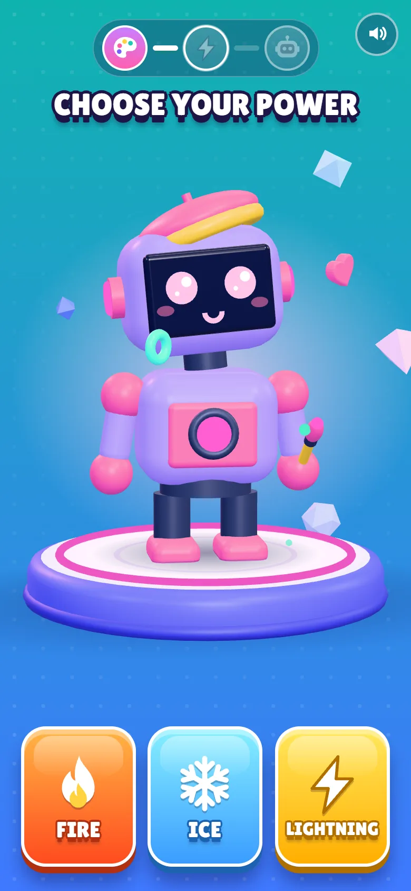
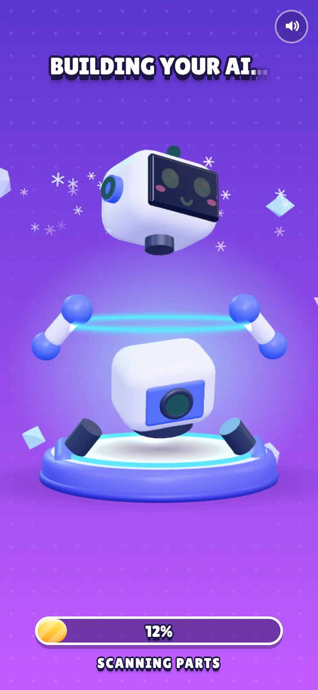
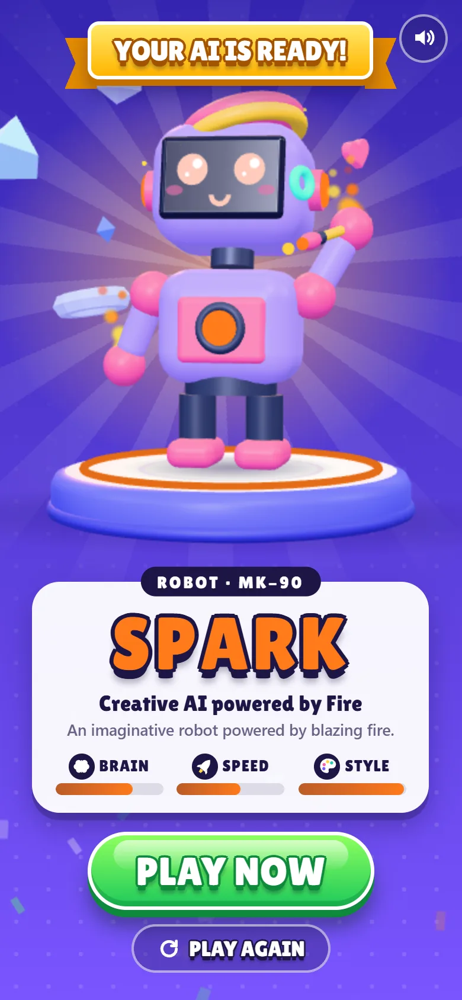
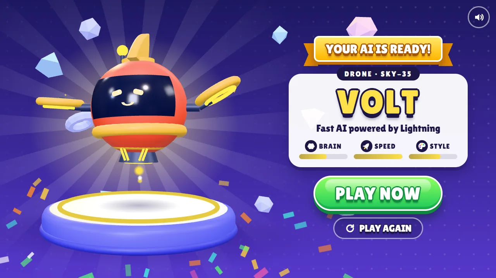
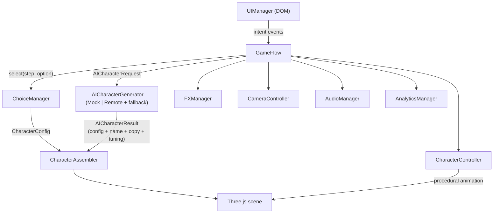

# Build Your AI

A mobile-first **HTML5 playable ad**: in about 20–40 seconds the player makes three quick choices, watches their own AI character assemble itself in 3D, and lands on a store CTA.

The engine is **TypeScript + Three.js** on a hand-written game layer. There is no game engine, no UI framework and no asset download: every character, sound and effect is generated at runtime. The production build is one self-contained HTML file.

<p align="center">
  
  
  
  
</p>
<p align="center">
  
</p>

## Live Demo

**▶ Play:** _add your deployment URL here_ (the included GitHub Pages workflow publishes `dist/index.html` on every push to `main`).

| URL parameter | Effect |
| --- | --- |
| `?dev=0` | Hides the developer overlay (the clean ad experience) |
| `?cta=CREATE%20YOUR%20AI` | Overrides the CTA label (A/B test hook) |
| `?sound=0` | Starts muted |
| `?dpr=1` | Caps the render pixel ratio |
| `?ai=remote` | Routes generation to a server endpoint; it falls back to the mock when that fails |
| `?nowebgl` | Previews the graceful-degradation screen |

Press **D** (or tap the `DEV` pill) to open live render stats and the analytics event stream.

## Gameplay

```
INTRO ─▶ PERSONALITY ─▶ POWER ─▶ BODY ─▶ BUILD ─▶ REVEAL + CTA ─▶ (PLAY AGAIN)
```

1. **Intro.** A polished robot waves at the player, and **START** is the only action. A tutorial hand appears after 1.2 s of idling.
2. **Personality** (Smart / Fast / Creative). Changes the paint, the face, the accessory kit (glasses and headset, fins and jet boosters, beret and paintbrush) and the idle attitude.
3. **Power** (Fire / Ice / Lightning). Sets the energy colour and adds power VFX (hand flames, ice crystals and snow, lightning arcs), with an activation burst and a jump.
4. **Body** (Robot / Android / Drone). Swaps the modular rig. Every accessory and effect re-seats itself on the new body.
5. **Build.** The parts explode outward, a scanner sweeps the body, the parts snap back one by one, the eyes power on and the character jumps into a hero pose. The AI request runs during this animation, so its latency is hidden.
6. **Reveal.** A generated name (for example `SPARK`, `FROST`, `VOLT`), a model code, a tagline, stat bars, confetti, the **PLAY NOW** CTA and **PLAY AGAIN**.

Replay resets all state in code: no page reload and no leaked objects.

## Tech Stack

- **TypeScript** in strict mode, with no `any`
- **Three.js / WebGL 2**: custom GLSL for particles, lightning and beams
- **HTML5 + CSS** for the game UI (design tokens, container-independent layout)
- **Node.js + Vite** for the dev server and a single-file production build
- **Web Audio API** for procedural SFX
- **Pointer Events** for one input path covering mouse, touch and pen

Runtime dependencies: **`three` only.**

## Features

- **Mobile-first playable ad:** a 9:16 portrait design that becomes a two-column layout on landscape and desktop
- **Touch and mouse input:** tap and click, hover states, drag to spin the character, keyboard activation
- **Modular 3D character system:** 3 rigs, 4 face styles, 9 accessories and 6 power effects, combined through named sockets
- **AI-ready architecture:** a generator interface with a deterministic mock, a validated remote client, and a timeout/fallback decorator
- **Data-driven configuration:** choices, names, VFX presets, camera shots, build beats and ad knobs all live in `src/data`
- **Analytics events:** the full playable funnel with pluggable sinks
- **Replayable gameplay:** instant, allocation-free restart
- **WebGL optimisation:** about 60 draw calls, zero textures to download, pooled particles and adaptive quality
- **Polish:** squash and stretch, blinking, gaze that follows the pointer, a tutorial hand, screen shake, colour-tweened themes, synth SFX and haptics
- **Resilience:** a WebGL fallback screen, context-loss handling, audio that is optional and safe when it fails, and no unhandled rejections

## Architecture



The architecture follows these rules:

- **The UI never touches the character.** It renders view models and emits intent (`select`, `cta`, …).
- **`CharacterConfig` is the single source of truth.** `resolveCharacterConfig(selections)` is a pure function. The live preview and the AI generator both use it.
- **`CharacterAssembler` diffs configs.** Paint changes are colour tweens on shared materials. Parts pop in and out. Rigs, faces and attachments are cached, so switching the body type or restarting never rebuilds geometry.
- **Everything attaches through sockets** (`headTop`, `face`, `back`, `handR`, …) on the `BodyRig` interface. A beret works on the robot, the android or the drone without special cases.
- **`GameFlow` orchestrates but owns nothing.** It is a small state machine that turns UI intent into feedback: character reaction, VFX, camera, audio and analytics.

```
src/
  core/        GameApp (composition root + loop), Tweener, Sequence, EventBus, QualityManager
  scene/       SceneManager, CameraController, Stage (pedestal), Backdrop
  character/   CharacterConfig, CharacterAssembler, CharacterController, materials, geometry cache
    parts/     rigs, face, accessories, effects, BodyRig/Attachment contracts
  ai/          IAICharacterGenerator, Mock / Remote / Resilient generators, name resolver
  gameplay/    GameFlow, ChoiceManager
  fx/          ParticleSystem (GPU points), LightningArcs, EnergyFX, presets
  ui/          UIManager, screens, components, icons, DevPanel, styles (tokens.css …)
  input/       InputManager (Pointer Events)
  audio/       AudioManager + SFX recipes
  analytics/   AnalyticsManager + sinks
  ads/         AdBridge (MRAID / Google ExitApi / demo)
  data/        personalities, powers, bodyTypes, names, steps, adConfig, cameraShots …
```

**Adding a personality** means adding one entry to `src/data/personalities.ts`, with a paint job, face, accessory ids, idle style and card colours, plus optional name rules in `names.ts`. No gameplay code changes. A new accessory is one factory in `parts/accessories.ts`.

## AI Integration

All of the game's AI traffic goes through one interface:

```ts
interface IAICharacterGenerator {
  readonly id: string;
  generateCharacter(request: AICharacterRequest, options?: { signal?: AbortSignal }): Promise<AICharacterResult>;
}
```

- **`MockAICharacterGenerator`** (the default) is deterministic: a hash of the request seeds names, stats and visual tuning. It adds simulated latency, so the UX is designed around a real async call.
- **`RemoteAICharacterGenerator`** POSTs the request to a server endpoint (the model key never ships inside the ad). It treats the response as untrusted: text is trimmed and length-capped, numbers are clamped, and unknown poses are dropped. The part structure is always derived from the validated request, never from free-form model output, so a model can only tune visuals and write copy inside the art-directed vocabulary.
- **`ResilientAICharacterGenerator`** is a decorator that gives the primary generator a time budget (`aiTimeoutMs`) and falls back to the mock on timeout or error. A playable must never hang on a spinner.
- **`createAIGenerator()`** is the only place that chooses the implementation. Switching to a real backend is a one-line change there (or `?ai=remote`). `GameFlow`, the UI and the character system stay untouched.

In practice, the endpoint behind `RemoteAICharacterGenerator` would prompt an LLM with the three choices and a JSON schema, and return `{ name, tagline, description, tuning, stats }`.

## Performance

These figures come from `renderer.info` in the dev overlay at 390×844:

| Metric | Value |
| --- | --- |
| Production build | **1 HTML file, 730 KB (199 KB gzip)**: JS, CSS and font inlined |
| Network requests after load | **0** |
| Draw calls | 46 (intro) to about 63 (peak VFX) |
| Triangles | about 16–23k |
| Shader programs | 15 |
| Textures | 3, all generated at runtime (a 64 px gradient and the PMREM environment); none downloaded |
| JS heap | about 21–23 MB |
| Time to interactive | about 1.7 s from `file://` (headless Chrome, desktop GPU) |

Optimisation decisions:

- **No textures or models to download.** Geometry is procedural, built from about 40 cached primitives shared through `mesh.scale`. The only "images" are a 64 px canvas gradient and the PMREM environment generated at boot.
- **Shared, role-based materials** (`primary`, `secondary`, `energy`, …). Changing the paint animates about 10 material colours instead of rebuilding meshes.
- **Static part meshes bake their matrices** (`matrixAutoUpdate = false`). Only joint and wrapper groups animate.
- **No shadow maps.** Blob shadows on the pedestal cost zero extra passes. No post-processing, and the character has no transparency except a few intentional FX.
- **The CSS background is transparent to WebGL.** The gradient, light rays and glow are CSS, so the GPU never fills a fullscreen quad for them.
- **Pooled GPU particles.** There is one draw call per blend mode, struct-of-arrays typed buffers, swap-remove on death, partial buffer uploads (`addUpdateRange`), and zero per-frame allocations. Sprite shapes are drawn in the fragment shader.
- **Lightning is a single dynamic ribbon mesh**, with arcs re-jagged about 20 times per second.
- **Prewarm after first paint.** Every rig and attachment combination is built, and every shader compiled, during idle time, so no choice causes a hitch mid-play.
- **Adaptive quality.** `QualityManager` watches frame time and steps down pixel ratio and particle density on struggling devices. The pixel ratio is capped at 2.
- **Loop discipline.** A single `requestAnimationFrame` loop with dt clamping, paused when the tab is hidden or the WebGL context is lost. DOM writes are throttled (the dev overlay refreshes at 2 Hz, and the focus CSS variables are only written when they move at least 1 px). Layout is only read on resize or screen changes.
- **Asset sizes.** The subset `woff2` font is 6 KB (Latin glyphs only). SFX are synthesised with Web Audio, at 0 KB.

## Playable Ad Design

- **Fast first interaction.** No intro cinematic and no loading screen. An inline boot splash is painted before any JS runs, and START becomes interactive about 1.7 s after opening the file (measured headless on a desktop GPU, including page creation). The tutorial hand appears after 1.2 s idle (2.4 s on choice screens, 3.2 s on the CTA).
- **Short loop.** 3 taps, then a 3 s build, then the end card: about 15 s of play and 20–40 s including the reveal. Every choice auto-advances after its reaction plays.
- **Clear CTA.** A large glossy button with pulse and shine, a hand hint on idle, and an alive end card: the character cheers and throws confetti every few seconds. The CTA goes through `AdBridge` (`mraid.open`, `ExitApi.exit`, or the demo toast) and fires `CTA_CLICKED`.
- **Mobile-first UX.** Thumb-zone cards, 40 px or larger hit targets, safe-area insets, a 9:16 layout unit (`--u`), a dedicated landscape layout, haptics, no 300 ms tap delay, and cards that ignore input while popping in (no accidental double-tap picks).
- **Immediate feedback.** Every tap gets a press state, a sound, a character reaction, VFX, a camera punch or shake, and a theme colour shift.

### Analytics

`AnalyticsManager` tracks the funnel (`PLAYABLE_STARTED`, `START_CLICKED`, `PERSONALITY_SELECTED`, `POWER_SELECTED`, `BODY_SELECTED`, `CHARACTER_GENERATED`, `PLAYABLE_COMPLETED`, `CTA_CLICKED`, `RESTARTED`) with a timestamp, session time, session id and metadata:

```json
{ "eventName": "POWER_SELECTED", "timestamp": 1790283011427, "sessionTime": 5210, "sessionId": "k3v9x2qa", "metadata": { "power": "LIGHTNING", "step": 2 } }
```

Sinks are pluggable. The console and `localStorage` (key `bya.analytics`) are included, and a network or MMP sink would be one class.

## Development

```bash
npm install
npm run dev        # http://localhost:5173 (also exposed on your LAN for phone testing)
npm run typecheck
```

## Production Build

```bash
npm run build      # typecheck + dist/index.html (single self-contained file)
npm run preview
```

`dist/index.html` is ready to upload to ad networks or any static host, and it also works from `file://`.

## Quality Assurance

The flow was verified end-to-end with automated headless Chrome and Edge runs (puppeteer-core, kept outside the repo). They drive real Pointer Events and capture screenshots at every beat:

- All three example combinations (SPARK / FROST / VOLT), with the full analytics funnel captured
- Three consecutive playthroughs using PLAY AGAIN
- Rapid tapping on START and on the cards: exactly one selection per step
- Mid-flow resizing across 360×640, 390×844, 412×915, 768×1024, 844×390 and 1440×900, with no UI overflow
- The WebGL fallback screen, and the remote-AI failure falling back to the mock
- The production `dist/index.html` opened from `file://` in Chrome and Edge, with zero external requests
- Zero console errors or warnings

## Credits

- Font: [Lilita One](https://fonts.google.com/specimen/Lilita+One) by Juan Montoreano, SIL Open Font License 1.1 (subset embedded).
- Everything else (models, VFX, icons, sound) is procedural and original to this project.
